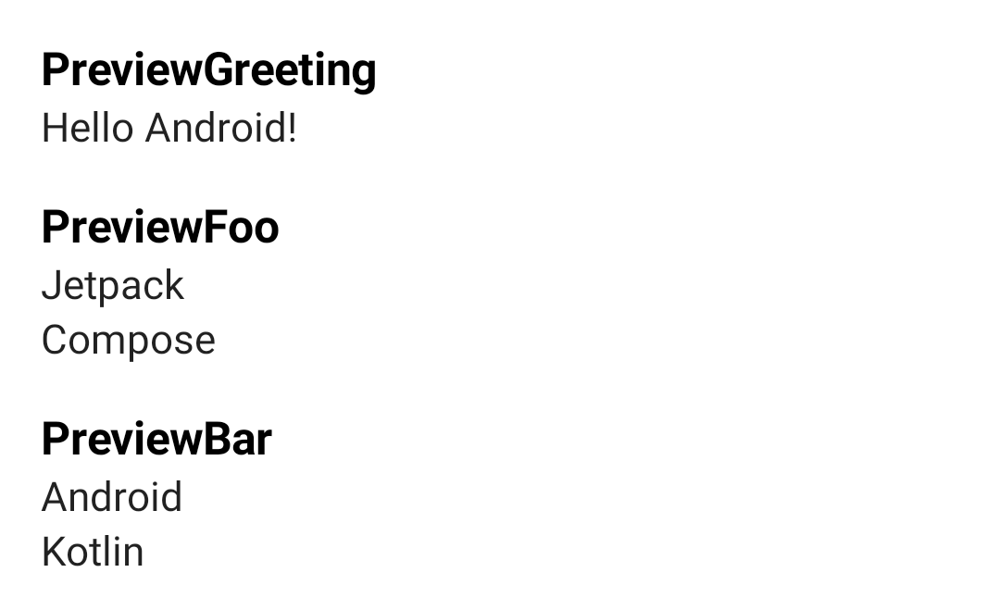

# Compose Preview Collector

This repository is a sample that collects and displays `@Preview` functions of Compose.

This sample uses [KSP](https://github.com/google/ksp) to collect `@Preview` functions.

## Usage

At first, write a `@Preview` code.

```kotlin
@Preview(showBackground = true)
@Composable
fun PreviewGreeting() {
    // ...
}
```

And then, call the code generated code by KSP.

```
setContent {
    // Generated by ksp
    com.star_zero.compose.previewcolletctor.PreviewCollection()
}
```

Please see the code in this repository for more details.

## Screenshot

This screenshot is a sample. You can see it by running the sample app in this repository.



## License

```
Copyright 2021 Kenji Abe

Licensed under the Apache License, Version 2.0 (the "License");
you may not use this file except in compliance with the License.
You may obtain a copy of the License at

http://www.apache.org/licenses/LICENSE-2.0

Unless required by applicable law or agreed to in writing, software
distributed under the License is distributed on an "AS IS" BASIS,
WITHOUT WARRANTIES OR CONDITIONS OF ANY KIND, either express or implied.
See the License for the specific language governing permissions and
limitations under the License.
```
